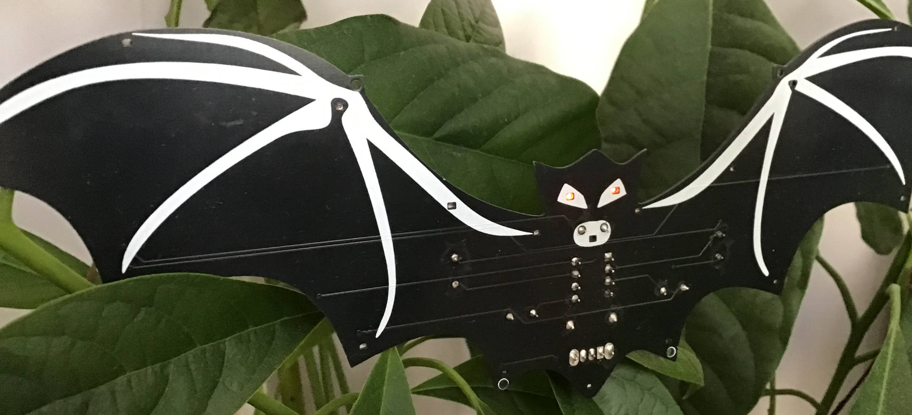
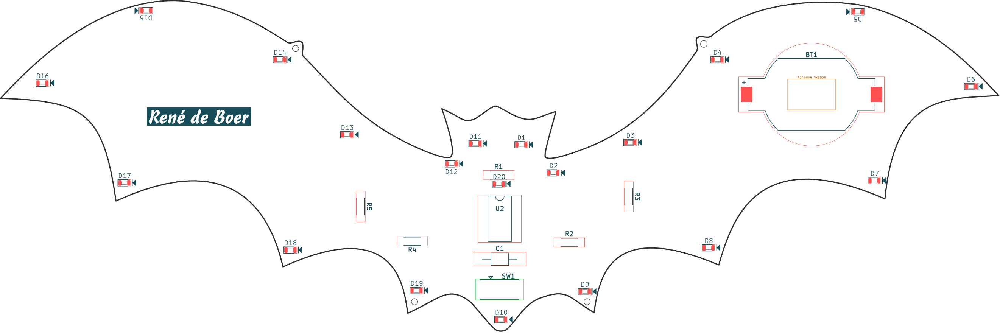
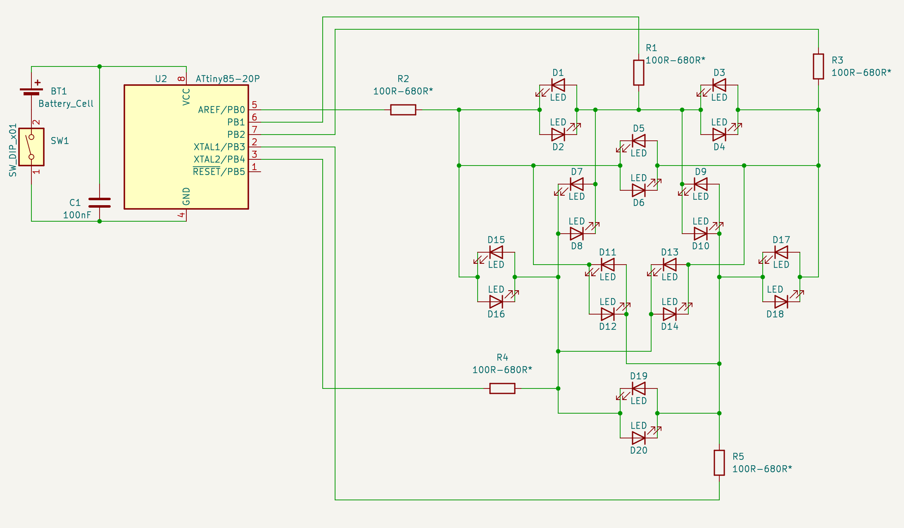
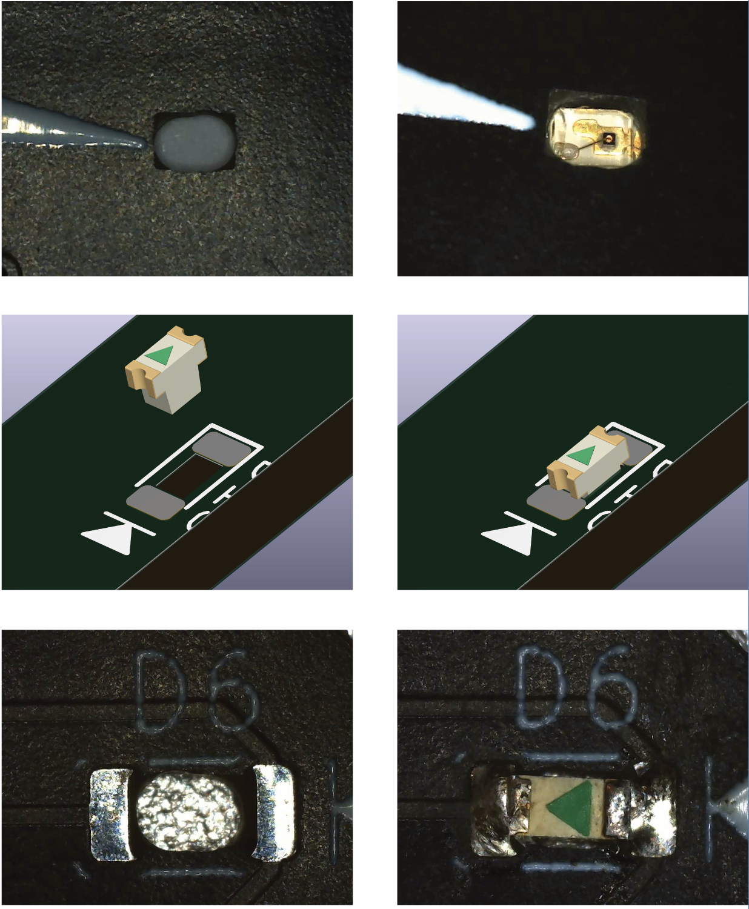
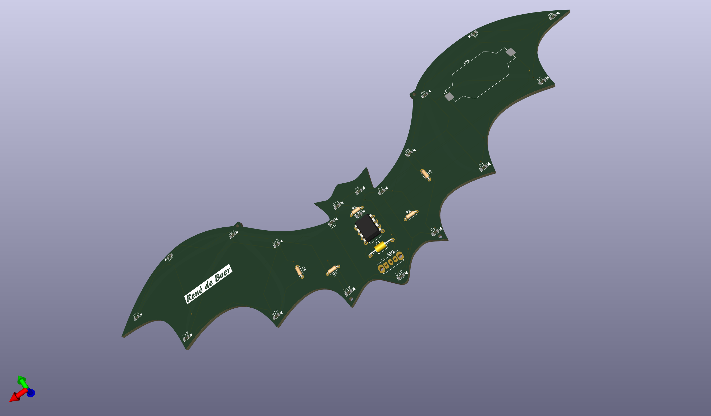

# 🦇 Bouw je eigen vleermuis!

Deze printplaat in vleermuisvorm laat 20 SMD-LEDs tot leven komen met slechts vijf aansluitingen van een microcontroller.

Dit pakket bevat een voor-geprogrammeerde **ATTINY85**-microcontroller.  
De code en schema’s zijn ook beschikbaar via GitHub.  
Op die manier kun je solderen, experimenteren, leren en eigen effecten ontwerpen.

---

## 📦 Inhoud pakket

- Printplaat in vleermuis vorm  
- **U2** ATTINY85 processor (geprogrammeerd) met ic-voet  
- **D1..D20** Oranje SMD LEDs formaat 0603 0,8×1,6 mm (+1 reserve LED)  
- **R1..R5** Weerstand 560Ω (ø1,9mm 3,7mm)  
- **C1** Condensator 100nF axiaal  
- **SW1** Schakelaar  
- **BT1** Batterijhouder voor CR2032 batterij of equivalent  
- **Batterij** CR2032, EXP zie verpakking  

---

## ⚙️ Hoe werkt het?

In dit vleermuis-bouwpakket sturen de vijf pinnen van de **ATTINY85** samen 20 LEDs aan, volgens een complex lichtpatroon in de broncode.  
Hierdoor kunnen de vleugels, ogen en mond afzonderlijk oplichten. 

De slimme techniek hierachter heet **Charlieplexing**.  
Door elke pin afwisselend als HIGH, LOW of hoog-ohmig (input) te zetten, kunnen meerdere LEDs onafhankelijk van elkaar oplichten. 

De naam komt van de bedenker, **Charlie Allen**.  
Hij ontdekte in de jaren 90 dat je op deze manier veel meer LEDs kunt aansturen dan het aantal beschikbare pinnen.

---

## 🔧 Montage van de SMD LEDs

De printplaat is speciaal ontworpen met kleine openingen op de plekken van de LEDs.  
Tijdens de montage plaats je de LEDs aan de soldeerzijde van de print.  

De lens van elke LED steek je door de opening, zodat hij zichtbaar wordt aan de voorkant.  
Op de LED is een klein driehoekje zichtbaar: dit symbool markeert de polariteit en komt overeen met het diode-symbool.

**Soldeertechnieken:**
- Met een hete-luchtstation werk je snel en gelijkmatig.  
- Een fijne soldeerboutpunt voldoet hier ook, mits je secuur te werk gaat.  

### 💡 Tips voor een strakke montage
- Gebruik een pincet met vlakke schop om de LED in positie te houden.  
- Haal telkens één LED tegelijk uit de verpakking, zo voorkom je zoekgeraakte onderdelen. Er is 1 reserve SMD LED meegeleverd.  
- Werk boven een klein schaaltje in plaats van een vlakke tafel: dat voorkomt dat een LED wegschiet.  
- Een microscoop of loeplamp is een handig hulpmiddel bij het uitlijnen.  

---

## 🔩 Montage van de overige componenten

De THT-componenten plaats je als laatste.  

- Let er bij de batterijhouder op dat de **+ markering** overeenkomt met de aanduiding op de print.  
- Het IC (**ATTINY85**) oriënteer je met de inkeping bij pin 1.  

Met wat geduld en precisie wordt de montage strak en komt de vleermuis straks écht tot leven.  

---

## 📜 License

This project is licensed under **Creative Commons Attribution-NonCommercial 4.0 International (CC BY-NC 4.0)**.

- ✅ You may view, copy, and use the files for **personal, non-commercial purposes**.  
- 🚫 Commercial use, redistribution, or resale is **not allowed** without prior written permission.  
- ⚠️ The files are provided **as-is**, without warranty.  

Full license text: [LICENSE](LICENSE)

For commercial licensing requests, please contact: mail@rene-de-boer.nl (www.rene-de-boer.nl)
